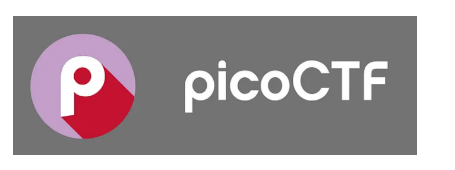

# Template - Writeup


## Introdução

"sempre tem alguém que sabe mais que você lá fora, então seja essa pessoa lá fora." 

Informações sensiveis não devem ser inseridas em locais "estáticos" (historico de commits, "hardcoded" sem qualquer tipo de proteção avançada, ou até no meio de uma lista imensa de palavras), criptografados usando uma chave simétrica (que seja muito conhecida, como base64 e cifra de césar ou que usa um esquema de embaralhamento muito básico) e entre outras formas de 


## Category
### Desafio 1 - 

image description

steps necessary to solve

What you learned
### Challenge2

image description

steps necessary to solve
```some code here maybe```

What you learned

