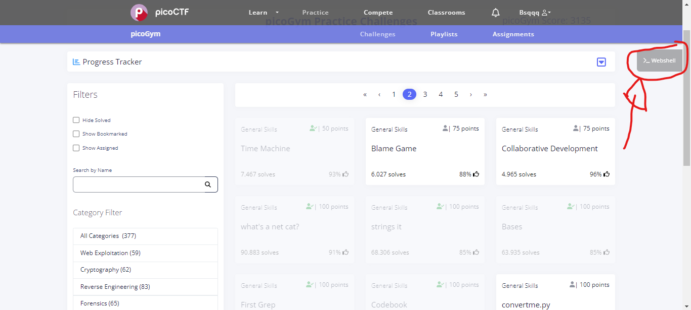

# Writeups (PW Crack 5, Time Machine, strings it, money-ware, Bases)


## Introdução

"Sempre tem alguém que sabe mais que você lá fora, então seja essa pessoa lá fora."

Informações sensiveis não devem ser inseridas em locais "estáticos" (historico de commits, "hardcoded" sem qualquer tipo de proteção avançada, ou até no meio de uma lista imensa de palavras), criptografados usando uma chave simétrica (que seja muito conhecida, como base64 e cifra de césar ou que usa um esquema de embaralhamento muito básico), nestes CTF's resolvidos, vamos dar uma olhada em como não devemos deixar expostas informações sensíveis e como podemos usar "Inteligência Aberta" (OSINT) para encontrar informações importantes para investigações em domínios públicos...


## Desafios
### Desafio 1 - Time Machine

Descrição do desafio 1 - Time Machine

steps necessary to solve

Para resolver a Time Machine, é fundamental ter conhecimento em ferramentas de versionamento como o Git, pois é pelo histórico de commits que vamos focar a resolução deste desafio, também será necessário ter um dominio básico em comandos do Linux. 

Para começar, precisamos baixar o arquivo .zip que está sendo mencionado na descrição do desafio, podemos fazer isso usando a webshell do próprio picoCTF com o comando `wget` e a URL de download dos arquivos, desta forma apresentada abaixo. (Detalhe: estou usando Windows para visualizar o desafio, mas a resolução será contemplada em um ambiente Linux)


Faça o login na webshell usando as mesmas credenciais de login do picoCTF:


Digite as credenciais nos respectivos campos solicitados


E você estará liberado a usar a webshell! Em seguida, vamos usar o comando mencionado anteriormente para baixar o arquivo .zip da descrição do desafio, mas antes, por questões de organização, vamos criar uma pasta para este problema para não misturar os arquivos de outros desafios, isso é uma boa pratica para se fazer. Fazemos `mkdir <nome_da_pasta>` para criar a pasta e depois `cd <nome_da_pasta>` para ir para dentro da pasta... (aqui usei `ls` para mostrar o antes e depois de criar a pasta).


Agora vamos finalmente baixar o arquivo usando o comando `wget` e o link de download do arquivo logo em seguida.


Rodando o comando `ls` para ver se o arquivo .zip consta no nosso diretório atual...


O próximo passo é descompactar o arquivo, pois como ele vem na extensão .zip não podemos trabalhar diretamente com ele desta forma. Para isso vamos rodar o comando `unzip challenge.zip`


Verá que o retorno deste comando é um monte de logs mostrando os arquivos e pastas que foram criados e extraidos, fazendo um `ls` novamente veremos que depois desta operação de descompactação, foi criado uma nova pasta chamada `drop-in`, vamos entrar nessa pasta usando o comando `cd drop-in` e vamos olhar o que tem dentro usando `ls`...


Algo não parece fazer muito sentido a primeira vista, vimos um log cheio de arquivos criados e extraidos, mas quando damos `ls` estamos apenas vendo um único arquivo chamado `message.txt`... 

Isso se deve ao fato de que quase todos os arquivos extraidos estão dentro de um diretório oculto, portanto ele não será exibido por padrão numa listagem básica, mas se fizermos o comando `ls -la` podemos visualizar os arquivos ou pastas ocultas e ainda em forma de lista, mostrando mais detalhes sobre os mesmos... mas não é por aqui que vamos conseguir resolver este desafio...

Como visto anteriormente na descrição do desafio, uma dica que o desafio dá é usar o comando `cat` para ler um arquivo, mas que nesse caso vai ser inútil aqui... pois na verdade o que nós estamos buscando neste desafio é ver um histórico de modificações neste diretório e não o que está escrito atualmente no arquivo, por isso o uso e dominio de uma ferramenta de versionamento é fundamental para este desafio.

Usando o Git, executamos o comando `git reflog` ou `git log` para ver o histórico de commits feitos naquele diretório, isso é obtido graças as pastas e arquivos que foram extraidos no passo de descompactação do arquivo .zip

Ao rodar um dos dois comando citados acima, obtemos um histórico de modificações deste diretório e Eureka!


Conseguimos a flag para o desafio Time Machine! Em geral um desafio bem fácil e simples. O desafio nos ensinou a olhar por lugares onde normalmente não olhariamos normalmente, isso é um reforço para a prática de reconhecimento do alvo, e não só pra nos ensinar comando novos.

### Desafio 2 - PW Crack 5

Descrição do desafio 2 - PW Crack 5

Para resolver o desafio PW Crack 5, precisamos primeiro baixar todos os arquivos que é disponibilizado na descrição do desafio, ao todo baixaremos 4 arquivos diferentes, além de ter o python instalado na sua estação/máquina.

Para não perder o costume, vamos criar uma pasta para este desafio e colocar todos os arquivos necessários lá dentro, usando o comando `mkdir <nome_da_pasta>` e `cd <nome_da_pasta>` para criar e navegar para dentro da pasta... no meu caso o nome da pasta vai ser "PW_Crack_5".


Neste desafio, vou usar meu próprio ambiente sem usar a webshell do picoCTF, por conta de que se trata de um código em python, e na minha experiência editando este código usando o editor de texto do próprio webshell tive problemas com a identação inconsistente, então resolvi fazer no Visual Studio Code da minha maquina pessoal, mas fique a vontade para fazer como achar melhor, um editor de texto não deve ser um impecilio para seguir a rigor este passo a passo.

Após isto, vou aproveitar e baixar os arquivos necessários usando a interface gráfica do Windows, apertando individualmente em cada link na descrição do desafio e colocando dentro da pasta que criei para este desafio. No final vamos ter estes arquivos listados abaixo dentro do diretório:

    - level5.py
    - dictionary.txt
    - level5.hash.bin
    - level5.flag.txt.enc

Vamos executar o programa para ver o seu comportamento de forma dinâmica com o comando `python level5.py` na linha de comando


Após rodar o comando citado, o programa imprime um texto pedindo para inserir a senha para a flag, em seguida entro com qualquer input só para ver o que mostra depois.

Agora, para fins didáticos e de comparação de código, duplicaremos o arquivo `level5.py` e renomearemos o novo para `level5resolved.py`, deixando o diretório com 1 novo arquivo. Agora podemos focar em desenvolver uma solução para este problema.

Abrindo o arquivo `level5resolved.py` em um editor de texto, vemos como o algoritmo deste desafio funciona, no qual está descrito logo a baixo

```python
### THIS FUNCTION WILL NOT HELP YOU FIND THE FLAG --LT ########################
def str_xor(secret, key):
    #extend key to secret length
    new_key = key
    i = 0
    while len(new_key) < len(secret):
        new_key = new_key + key[i]
        i = (i + 1) % len(key)        
    return "".join([chr(ord(secret_c) ^ ord(new_key_c)) for (secret_c,new_key_c) in zip(secret,new_key)])
###############################################################################

flag_enc = open('level5.flag.txt.enc', 'rb').read()
correct_pw_hash = open('level5.hash.bin', 'rb').read()

def hash_pw(pw_str):
    pw_bytes = bytearray()
    pw_bytes.extend(pw_str.encode())
    m = hashlib.md5()
    m.update(pw_bytes)
    return m.digest()

def level_5_pw_check():
    user_pw = input("Please enter correct password for flag: ")
    user_pw_hash = hash_pw(user_pw)

    if( user_pw_hash == correct_pw_hash ):
        print("Welcome back... your flag, user:")
        decryption = str_xor(flag_enc.decode(), user_pw)
        print(decryption)
        return
    print("That password is incorrect")

level_5_pw_check()
```

Aparentemente, a função `level_5_pw_check()` age como a função principal, então vamos focar nessa função... Observando as primeiras instruções dessa função, podemos ver as instruções que praticamente vão determinar o comportamento do código... 

Mas para conseguirmos passar por essa verificação, precisamos usar a lista de senhas que foi disponibilizado na descrição do problema, juntamente onde temos as linhas 13 e 14 vou colocar a importação desta lista, similar a como foi importado o outros 2 arquivos originais do desafio, então importando o arquivo `dictionary.txt`...

```python
flag_enc = open('level5.flag.txt.enc', 'rb').read()
correct_pw_hash = open('level5.hash.bin', 'rb').read()
lista = open("dictionary.txt", "r")
```

Voltando para dentro da função principal do programa, faremos essa implementação:
```python
def level_5_pw_check():
    for linha in lista:
        user_pw = linha.strip()
        user_pw_hash = hash_pw(user_pw)
        if( user_pw_hash == correct_pw_hash ):
            print("Welcome back... your flag, user:")       
            decryption = str_xor(flag_enc.decode(), user_pw)
            print(decryption)
            return
        print("That password is incorrect")
```

O que foi feito nesta função foi a iteração sobre as entradas da lista de senhas do arquivo de texto que acabamos de importar e trocamos o que a variável `user_pw` recebe por essa `linha.strip()`, tudo que fazia parte do corpo da função está dentro deste loop, então note a identação deste trecho. (Detalhe: a função `strip()` serve para limpar espaços vazios nas linhas ao iterar sobre elas, tirando qualquer espaço vazio no começo e fim da linha, se não feita desta forma pode ocorrer "falsos positivos")

Desta forma, o programa não nos perguntará mais por uma entrada de senha e automaticamente a flag aparecerá na nossa frente quando executarmos este código no terminal.


Se quiser ver qual foi a senha que o programa estava esperando, podemos imprimi-la usando esse comando dentro da identação da verificação (marcado com seleção):


O desafio envolveu análise estática de código, juntamente usei o paradigma de força-bruta para quebrar a senha, dada uma "wordlist" para iterar sobre... pode não ser a solução mais elegante, mas é uma solução bem simples.

